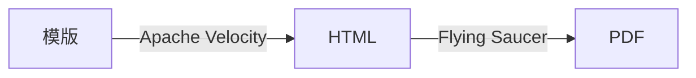
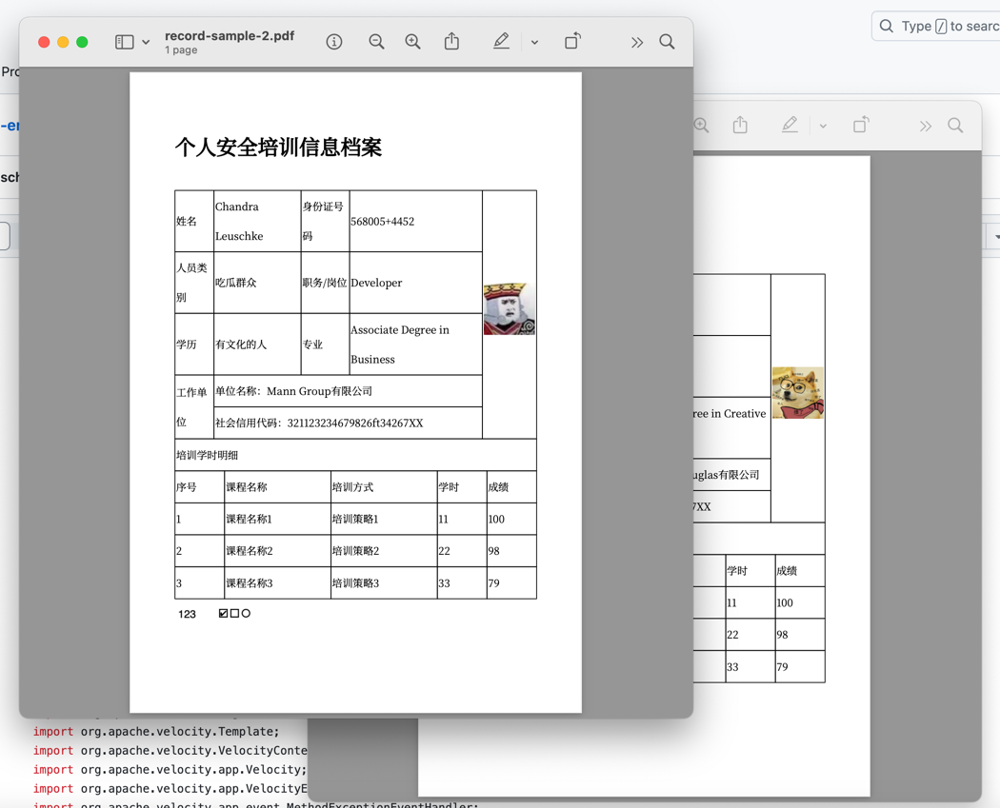

# Motto: motto-html

motto-html 是一款从 Apache Velocity 模版生成 PDF 文件的工具包。



这个工具库的表达能力比 [motto-pdf-itext8](https://github.com/ddrpa/motto-pdf-itext8)
更强，但是对于模版设计者来说可能会有一些不便。

## 使用方法

在 `pom.xml` 中添加依赖，最新版本应该是 `cc.ddrpa.motto:motto-html:1.1.0`。

你可以查看本项目的单元测试了解用法。

### 怎样准备模版

使用 Apache Velocity 的语法创建模版。

如果不想添加什么额外的字体，可以设置中文文本的 `font-family` 属性为 `STSong-Light-H`
或 `STSongStd-Light-H`。这两种字体的显示效果是比较细的无衬线字体。

Flying Saucer 支持了一小部分 CSS3 的特性，例如页面控制。可以在 HTML 文档中指定样式：

```css
@page {
  /* A4 大小，竖版 */
  size: A4 portrait;
  /* 或者横版 size: A4 landscape;*/
  /* 用 margin 指定页边距也是支持的 */
}
```

你可以参考 [How do you control page size?](https://flyingsaucerproject.github.io/flyingsaucer/r8/guide/users-guide-R8.html#xil_34)，对手动分页等内容也做了详细的说明。

此外，在创建模版时还需要注意：

- 模板样式应当遵循 [Cascading Style Sheets Level 2 Revision 1 (CSS 2.1) Specification](https://www.w3.org/TR/CSS21/)；
- 尽管 `` 这类标签支持自闭合，请使用 `</img>`；
- 使用 `pt` 设置图像元素的尺寸，特别是在使用了 `EmbeddedImage#setDevicePixelRatio` 的情况下；
- 设置字体族（`font-family`）时，首选项必须是 `STSong/STSongStd` 或其他预先部署到服务器环境并由程序显式读取的字体；
- 观察到 `E > F` 这种 Child selectors 在某些情况下似乎没有正确的应用 `font-family` 属性，因此如果输出文件中没有出现字符，请在 DOM 元素上通过内联样式设置 `font-family`；
- 请把 `<style>` 标签放在 `<head>` 里，不要放在 `<body>` 之中或之后；
- 请使用 <kbd>Ctrl</kbd> + <kbd>P</kbd> 或 <kbd>Cmd</kbd> + <kbd>P</kbd> 预览效果，而不是 DevTools；
- 不要尝试在模版内使用 JavaScript；

### 怎样添加字体

静态方法 `cc.ddrpa.motto.html.DocumentBuilder#addFont` 接受字体文件路径输入。在 HTML
中声明字体样式时，应当使用程序返回的字体名称。

```java
DocumentBuilder.addFont("font-seems-okay/Noto_Sans_SC/static/NotoSansSC-Regular.ttf");
```

### 怎样生成文件

创建一个 `cc.ddrpa.motto.html.DocumentBuilder` 对象并通过 `loadTemplate`
或 `loadTemplateFromPlainText` 方法以文件路径或模版字符串载入 Apache Velocity 模版。

```
DocumentBuilder builder = new DocumentBuilder()
    .loadTemplate("src/test/resources/record-template.html");
```

调用 `DocumentBuilder#merge` 方法添加数据，这个步骤可以重复多次。

```
builder.merge(Map.of(
  "name", faker.name().fullName(),
   "idCard", faker.idNumber().invalidSvSeSsn(),
   "category", "吃瓜群众",
   "records", List.of(
      new CourseRecord(1, "课程名称1", "培训策略1", 11, 100),
      new CourseRecord(2, "课程名称2", "培训策略2", 22, 98),
      new CourseRecord(3,
      // ... 
```

调用 `DocumentBuilder#save` 向给定的输出流保存 PDF 文件。

如果需要生成多份文件（例如邮件合并），可以通过 `DocumentBuilder#reset` 方法重置
builder，然后从调用 `DocumentBuilder#merge` 方法重新开始。

#### 怎样在生成的文档中插入图片

如果图片是一个网络资源，使用 `` 就好。

如果图片在你的 Resources 中，使用 `resources://` 前缀标识这个文件。 `src/main/resources/avatar.jpg`
可以写成 ``。

不过需注意图片会按其原始大小被嵌入文件，所以你可能会想要将其压缩后再插入文档。这时可以用 `cc.ddrpa.motto.html.embedded.EmbeddedImage`。

```java
EmbeddedImage compressed = EmbeddedImage.newInstance(fis)
    .setDotsPerPoint(dotsPerPoint)
    .setDotsPerPixel(dotsPerPixel)
    .setDevicePixelRatio(devicePixelRatio)
    .scaleWithPoint(228, 128);
```

如果你修改了 `devicePixelRatio`，请在模版中使用 `pt` 限制图像元素的大小。



我没有太过关注这里的样式，不过 CSS 2.1 应该是受到 Flying Saucer 支持的。
