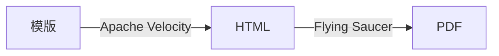

# Motto: motto-html

motto-html 是一款从 Apache Velocity 模版生成 PDF 文件的工具包。



这个工具库的表达能力比 [motto-pdf-itext8](https://github.com/ddrpa/motto-pdf-itext8)
更强，但是对于模版设计者来说可能会有一些不便。

## 使用方法

在 `pom.xml` 中添加依赖，最新版本应该是 `cc.ddrpa.motto:motto-html:1.0.0`。

你可以查看本项目的单元测试了解用法。

### 怎样准备模版

使用 Apache Velocity 的语法创建模版。

如果不想添加什么额外的字体，可以设置中文文本的 `font-family` 属性为 `STSong-Light-H`
或 `STSongStd-Light-H`。这两种字体的显示效果是比较细的无衬线字体。

#### 注意事项

- CSS 选择器支持有限，` < `可能会无法识别，推荐使用内联样式；
- Flying Saucer 少量支持 CSS 3 功能，主要集中在页面控制方面，Flexible Box Layout 这种还没有；
- 尽管 `` 这类标签支持自闭合，请使用 `</img>` 形式；
- 字体（`font-family`）必须在一个指定的范围内选择，例如 `STSong/STSongStd`，Noto 系列，以及其他版权所有方允许自由使用的字体，例如[寒蝉字型](https://github.com/Warren2060)等。同样，如果输出文件中没有出现字符，请在 DOM 元素上内联添加 `font-family`；
- 请把 `<style>` 标签放在 `<head>` 里，不要放在 `<body>` 中或之后；
- DocumentBuilder 使用了 Flying Saucer  的默认设置，即 1 Pixel = 20 Dots，1 Point = 26.6667 Dots。印刷方面的东西还是有一些门槛的，所以请多用 <kbd>Ctrl</kbd> + <kbd>P</kbd> 或 <kbd>Cmd</kbd> + <kbd>P</kbd> 预览效果，而不是使用 DevTools；

### 怎样添加字体

静态方法 `cc.ddrpa.motto.html.DocumentBuilder#addFont` 接受字体文件路径输入。在 HTML
中声明字体样式时，应当使用程序返回的字体名称。

```java
DocumentBuilder.addFont("font-seems-okay/Noto_Sans_SC/static/NotoSansSC-Regular.ttf");
```

### 怎样生成文件

创建一个 `cc.ddrpa.motto.html.DocumentBuilder` 对象并通过 `loadTemplate`
或 `loadTemplateFromPlainText` 方法以文件路径或模版字符串载入 Apache Velocity 模版。

```
DocumentBuilder builder = new DocumentBuilder()
    .loadTemplate("src/test/resources/record-template.html");
```

调用 `DocumentBuilder#merge` 方法添加数据，这个步骤可以重复多次。

```
builder.merge(Map.of(
  "name", faker.name().fullName(),
   "idCard", faker.idNumber().invalidSvSeSsn(),
   "category", "吃瓜群众",
   "records", List.of(
      new CourseRecord(1, "课程名称1", "培训策略1", 11, 100),
      new CourseRecord(2, "课程名称2", "培训策略2", 22, 98),
      new CourseRecord(3,
      // ... 
```

调用 `DocumentBuilder#save` 向给定的输出流保存 PDF 文件。

如果需要生成多份文件（例如邮件合并），可以通过 `DocumentBuilder#reset` 方法重置
builder，然后从调用 `DocumentBuilder#merge` 方法重新开始。

#### 怎样在生成的文档中插入图片

如果图片是一个网络资源，使用 `` 就好。

如果图片在你的 Resources 中，使用 `resources://` 前缀标识这个文件。 `src/main/resources/avatar.jpg`
可以写成 ``。

不过需注意图片会按其原始大小被嵌入文件，所以你可能会想要将其压缩后再插入文档。这时可以用 `cc.ddrpa.motto.html.embedded.EmbeddedImage`。

```
EmbeddedImage resizedImage = EmbeddedImage.newInstance(fis, EmbeddedResource.JPEG, 8, 8);
```


我没有太过关注这里的样式，不过 CSS 2.1 应该是受到 Flying Saucer 支持的。
