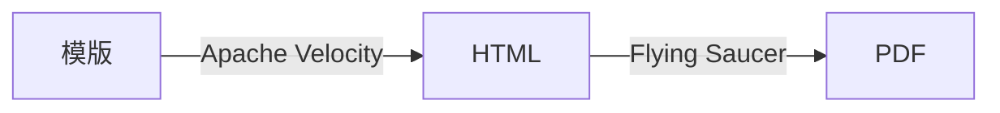

# Motto HTML

motto-html 是一款从 Apache Velocity 模版生成 PDF 文件的工具包。

## 使用方法

你可以查看本项目的单元测试了解用法，简单来说就是：

首先，你需要使用 Apache Velocity 的语法创建模版。如果不想添加什么字体，将中文文本的 `font-family` 设置为 `STSong-Light-H` 或 `STSongStd-Light-H`，这两种字体的显示效果是比较细的无衬线字体。

在 `pom.xml` 中添加依赖，最新版本应该是 `cc.ddrpa.motto:motto-html:1.0.0`。

如果要添加自己的字体，静态方法 `cc.ddrpa.motto.html.DocumentBuilder#addFont` 接受文件路径输入。在 HTML 中声明字体样式时，使用程序返回的字体名称。

创建一个 `cc.ddrpa.motto.html.DocumentBuilder` 对象并通过 `loadTemplate` 或 `loadTemplateFromPlainText` 方法以文件路径或模版字符串载入 Apache Velocity 模版。

调用 `DocumentBuilder#merge` 方法添加数据，这个步骤可以重复多次。

调用 `DocumentBuilder#save` 向给定的输出流保存 PDF 文件。

如果需要生成多份文件（例如邮件合并），可以通过 `DocumentBuilder#reset` 方法重置 builder，然后从调用 `DocumentBuilder#merge` 方法重新开始。

如何在生成的文档中插入图片？如果图片是一个网络资源，使用 `` 就好。如果图片在你的 Resources 中，使用 `resources://` 前缀标识这个文件，如 `src/main/resources/avatar.jpg` 可以写成 ``。

不过请注意，图片会按其原始大小被压缩，所以你可能会想要将其缩放后再插入文档。这时候使用 `cc.ddrpa.motto.html.embedded.EmbeddedImage` 就行。

