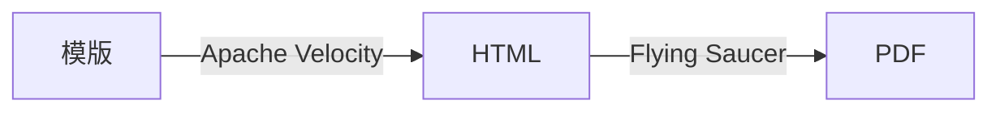
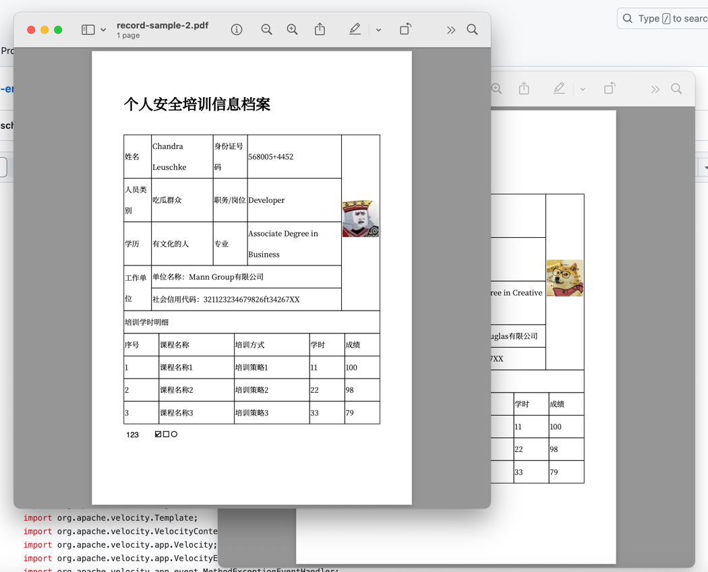

# motto-html

motto-html 是一款基于 Apache Velocity 模版引擎和 Flying Saucer 渲染器的 PDF 文档生成工具包。该工具包适用于需要从结构化数据批量生成格式化 PDF 文档的应用场景。


```mermaid
flowchart LR
    A["模版"] -- Apache Velocity --> B["HTML"] -- Flying Saucer --> C["PDF"]
```

这个工具库的表达能力比 [motto-pdf-itext8](https://github.com/ddrpa/motto-pdf-itext8) 更强，但是对于模版设计者来说可能会有一些不便。

## 概述

- 使用 Apache Velocity 模版语法定义文档结构
- 支持 CSS 2.1 规范的样式定义
- 支持自定义字体和 CJK 字符集
- 支持嵌入本地和网络图片资源
- 支持批量文档生成

## 安装

在项目的 `pom.xml` 文件中添加以下依赖：

```xml
<dependency>
    <groupId>cc.ddrpa.motto</groupId>
    <artifactId>motto-html</artifactId>
    <version>${motto-html.version}</version>
</dependency>
```

可在 [Maven Central](https://central.sonatype.com/artifact/cc.ddrpa.motto/motto-html) 查询最新版本号。

## 快速开始

你可以查看本项目的单元测试了解用法，例如创建 FontBook，字体加载，图片处理，通过模板生成 PDF（包括批量生成）等。

### 基本工作流程

1. 准备 Velocity 模版文件
2. 创建 `DocumentBuilder` 实例
3. 加载模版
4. 合并数据
5. 输出 PDF 文件

```java
// 创建 DocumentBuilder 并从 classpath 加载模版
DocumentBuilder builder = new DocumentBuilder()
    .loadTemplate("record-template.html");

// 添加数据，这个步骤可以重复多次
builder.merge(Map.of(
    "name", faker.name().fullName(),
    "idCard", faker.idNumber().invalidSvSeSsn(),
    "category", "吃瓜群众",
    "records", List.of(
        new CourseRecord(1, "课程名称1", "培训策略1", 11, 100),
        new CourseRecord(2, "课程名称2", "培训策略2", 22, 98),
        new CourseRecord(3, "课程名称3", "培训策略3", 33, 95)
    )
));

// 向给定的输出流保存 PDF 文件
try (FileOutputStream fos = new FileOutputStream("output.pdf")) {
    builder.save(fos);
}
```

## 模版开发

模版文件使用 Apache Velocity 语法。有关 Velocity 模版语言的详细信息，请参阅 [Apache Velocity 用户指南](https://velocity.apache.org/engine/2.3/user-guide.html)。

模版样式必须遵循 [CSS 2.1 规范](https://www.w3.org/TR/CSS21/)。Flying Saucer 渲染器支持部分 CSS3 特性，包括页面控制属性。

```css
@page {
    /* A4 大小，竖版 */
    size: A4 portrait;
    /* 或者横版 size: A4 landscape;*/
    /* 用 margin 指定页边距也是支持的 */
}
```

你可以参考 [How do you control page size?](https://flyingsaucerproject.github.io/flyingsaucer/r8/guide/users-guide-R8.html#xil_34)，对手动分页等内容也做了详细的说明。

### 注意事项

- 模板样式应当遵循 [Cascading Style Sheets Level 2 Revision 1 (CSS 2.1) Specification](https://www.w3.org/TR/CSS21/)；
- 尽管 `` 这类标签支持自闭合，请使用 `</img>`；
- 使用 `pt` 设置图像元素的尺寸，特别是在使用了 `EmbeddedImage#setDevicePixelRatio` 的情况下；
- 设置字体族（`font-family`）时，首选项必须是 `STSong/STSongStd` 或其他预先部署到服务器环境并由程序显式读取的字体；
- 观察到 `E > F` 这种 Child selectors 在某些情况下似乎没有正确的应用 `font-family` 属性，因此如果输出文件中没有出现字符，请在 DOM 元素上通过内联样式设置 `font-family`；
- 请把 `<style>` 标签放在 `<head>` 里，不要放在 `<body>` 之中或之后；
- 请使用 <kbd>Ctrl</kbd> + <kbd>P</kbd> 或 <kbd>Cmd</kbd> + <kbd>P</kbd> 预览效果，而不是 DevTools；
- 不要尝试在模版内使用 JavaScript；

## 字体配置

### 默认字体

如果对字体没有要求，可将中文文本的 `font-family` 属性设置为以下值之一：

- `STSong-Light-H` 是一种衬线字体
- `STSongStd-Light-H` 是一种无衬线字体

### 注册自定义字体

使用 `DocumentBuilder.addFont()` 静态方法注册外部字体文件：

```java
DocumentBuilder.addFont("/path/to/NotoSansSC-Regular.ttf");
```

> 注意: 字体文件通常较大，不建议打包至 JAR 文件中。建议将字体文件部署至服务器文件系统。

### 加载系统预装字体

自 1.2.2 版本起，可使用以下方法加载系统预装的字体：

```java
List<String> loadedFonts = DocumentBuilder.loadPreinstalledFontsAsCJKFont();
```

该方法返回成功加载的字体路径列表。这些字体会按照 CJK 字体来加载，因此可能产生意料之外的问题，可以执行 `cc.ddrpa.motto.html.LoadPreInstalledFontsTests` 预览效果。

### 查询已注册字体

```java
List<String> fontFamilies = DocumentBuilder.listFontFamily();
```

### 商用字体

商业项目请确保拥有合法的字体授权，本项目推荐使用三种开源字体，见 `font-seems-okay/` 目录：

- [Noto Sans CJK](https://www.google.com/get/noto/#sans-hans) - Google 出品的无衬线字体，可用于黑体
- [Noto Serif CJK](https://www.google.com/get/noto/#serif-hans) - Google 出品的衬线字体，可用于宋体
- [寒蝉正楷体](https://github.com/Warren2060/Chillkai) - 可用于楷体

## 图片处理

网络图片可直接在模版中引用：

```html
</img>
```

1.2.3 版本增加了通过 `ResourcesUserAgent` 配置访问网络资源的超时时间：

```java
ResourcesUserAgent userAgent = new ResourcesUserAgent(outputDevice, dotsPerPixel)
        .setHttpConnectTimeout(5, TimeUnit.SECONDS)
        .setHttpReadTimeout(10, TimeUnit.SECONDS);
```

访问资源失败时，该图片将被跳过。

### 资源目录图片

如果资源文件打包在 classpath 中，可使用 `resources://` 协议引用：

```html
</img>
```

上述路径对应 `src/main/resources/images/logo.png`。

### 调整图片的尺寸

对于需要压缩或调整尺寸的图片，使用 `cc.ddrpa.motto.html.embedded.EmbeddedImage` 类：

```java
EmbeddedImage image = EmbeddedImage.newInstance(inputStream)
    .setDevicePixelRatio(2)
    .scaleWithPoint(200, 100);

builder.merge("avatar", image);
```

在模版中引用：

```html
</img>
```

> 如果修改了 `devicePixelRatio`，必须在模版中使用 `pt` 单位限制图片尺寸。

## 批量生成

使用 `reset()` 方法重置 builder 状态，实现批量文档生成：

```java
DocumentBuilder builder = new DocumentBuilder()
    .loadTemplate("certificate.html");

for (Person person : personList) {
    builder.merge(Map.of("name", person.getName(), "date", person.getDate()));
    
    try (FileOutputStream fos = new FileOutputStream(person.getId() + ".pdf")) {
        builder.save(fos);
    }
    
    builder.reset();  // 重置状态，准备下一份文档
}
```

## API 参考

### `cc.ddrpa.motto.html.DocumentBuilder`

| 方法 | 说明 |
|------|------|
| `loadTemplate(String)` | 从 classpath 加载模版文件 |
| `loadTemplateFromStream(InputStream)` | 从输入流加载模版 |
| `loadTemplateFromPlainText(String)` | 从字符串加载模版 |
| `merge(Map<String, Object>)` | 合并数据至模版上下文 |
| `merge(String, Object)` | 合并单个键值对 |
| `save(OutputStream)` | 输出 PDF 至指定流 |
| `reset()` | 重置 builder 状态 |

### `cc.ddrpa.motto.html.embedded.EmbeddedImage`

| 方法 | 说明 |
|------|------|
| `newInstance(InputStream)` | 从输入流创建实例 |
| `newInstance(BufferedImage)` | 从 BufferedImage 创建实例 |
| `newInstance(byte[])` | 从字节数组创建实例 |
| `setDotsPerPoint(float)` | 设置点分辨率 |
| `setDotsPerPixel(int)` | 设置像素分辨率 |
| `setDevicePixelRatio(int)` | 设置设备像素比 |
| `scaleWithPoint(int, int)` | 按点单位缩放 |
| `scaleWithMillimetre(double, double)` | 按毫米单位缩放 |
| `toDataURL()` | 转换为 Data URL |

## 效果展示


